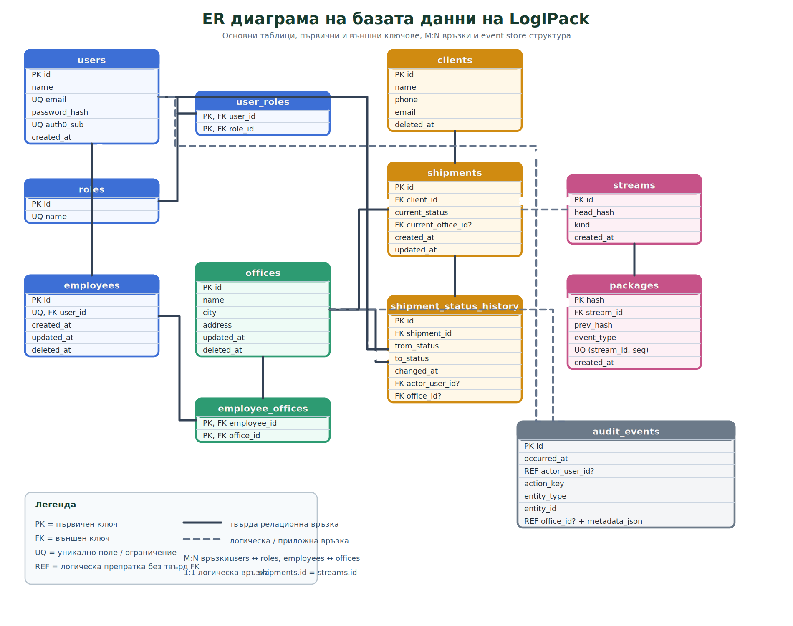

# Figure: ER диаграма на LogiPack

## Кратко тълкуване

- `users`, `roles` и `user_roles` реализират ролевия модел и връзката много към много между потребители и роли.
- `employees`, `offices` и `employee_offices` реализират служебната структура и връзката много към много между служители и офиси.
- `clients`, `shipments` и `shipment_status_history` описват основния оперативен модел на системата и проследимостта на промените по пратките.
- `streams` и `packages` представят event store слоя за неизменимата история, като `packages` са свързани към `streams`, а `streams.id` логически съвпада с `shipments.id`.
- `audit_events` пази общия одит на действията и използва логически препратки към потребители, офиси и други обекти чрез `entity_type` и `entity_id`.

## Подходящ надпис под фигурата

`Фиг. 5.2. ER диаграма на базата данни на LogiPack, представяща основните таблици, ключовите полета и връзките между тях.`
