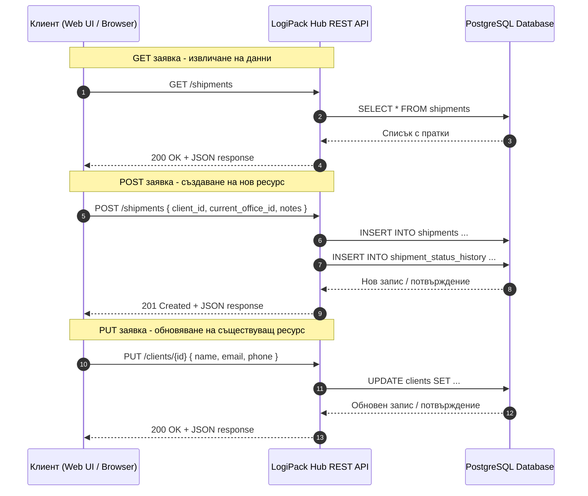

# Figure: Примерна схема на REST комуникация между клиент и сървър

## Кратко тълкуване

- `GET` заявката се използва за извличане на ресурси без промяна в състоянието на системата.
- `POST` заявката се използва за създаване на нов ресурс, например нова пратка.
- `PUT` заявката се използва за обновяване на вече съществуващ ресурс, например данните за клиент.
- Комуникацията е в `JSON` формат, а сървърът връща стандартни HTTP статус кодове като `200 OK` и `201 Created`.

## Подходящ надпис под фигурата

`Фигура X. Примерна схема на REST комуникация между клиентската част и сървърната част на системата чрез GET, POST и PUT заявки.`
