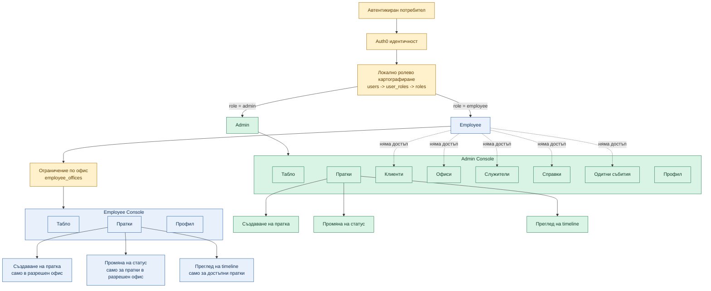

# Figure: Схема на ролево разграничение между Admin и Employee

## Кратко тълкуване

- `Admin` има пълен достъп до административните и оперативните модули: `Пратки`, `Клиенти`, `Офиси`, `Служители`, `Справки`, `Одитни събития`, `Профил`.
- `Employee` има достъп само до оперативната част: `Пратки`, `Профил`, `Табло`.
- Достъпът на `Employee` до модула `Пратки` е ограничен по офис чрез връзката `employees <-> offices` (`employee_offices`).
- `Employee` няма достъп до административните модули `Клиенти`, `Офиси`, `Служители`, `Справки` и `Одитни събития`.
