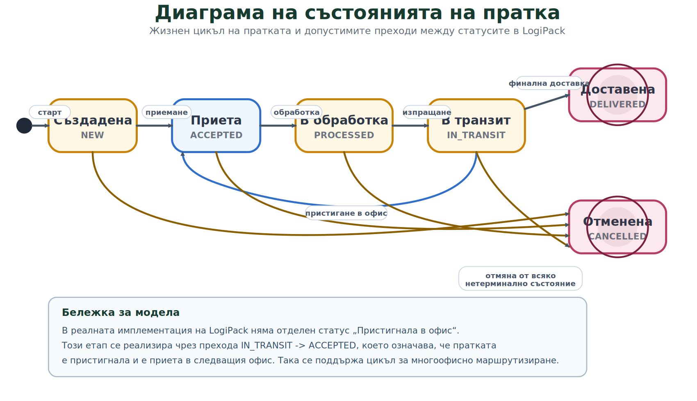

# Figure: Диаграма на състоянията на пратка

## Кратко тълкуване

- Диаграмата показва основния жизнен цикъл на пратката: `NEW -> ACCEPTED -> PROCESSED -> IN_TRANSIT -> DELIVERED`.
- От състоянията `NEW`, `ACCEPTED`, `PROCESSED` и `IN_TRANSIT` е позволен преход към `CANCELLED`.
- В реалната логика на системата `IN_TRANSIT -> ACCEPTED` означава пристигане и приемане на пратката в следващ офис.
- `DELIVERED` и `CANCELLED` са терминални състояния, от които не са позволени нови преходи.

## Подходящ надпис под фигурата

`Фиг. 5.3. Диаграма на състоянията на пратка в LogiPack, представяща основните статуси и допустимите преходи между тях.`
