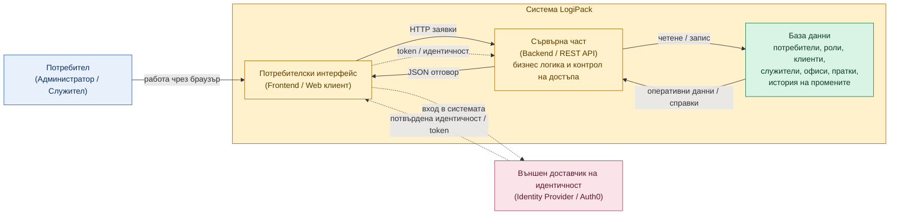

# Figure: Архитектурна схема на системата LogiPack

## Кратко тълкуване

- `Потребителският интерфейс` представлява уеб клиента, чрез който администратори и служители работят със системата.
- `Сървърната част` приема заявките, изпълнява бизнес логиката, контролира достъпа и връща резултат към интерфейса.
- `Базата данни` съхранява основните оперативни данни за потребители, роли, клиенти, служители, офиси, пратки и история на промените.
- `Външният доставчик на идентичност` удостоверява потребителя при вход, а приложението използва получената идентичност, за да определи локалните роли и права.
- Основният оперативен поток е `Потребител -> Frontend -> Backend -> Database -> Backend -> Frontend`, а при вход в системата участва и външният доставчик на идентичност.

## Подходящ надпис под фигурата

`Фигура 4.1. Архитектурна схема на системата LogiPack, представяща взаимодействието между потребителския интерфейс, сървърната част, базата данни и външния доставчик на идентичност.`
