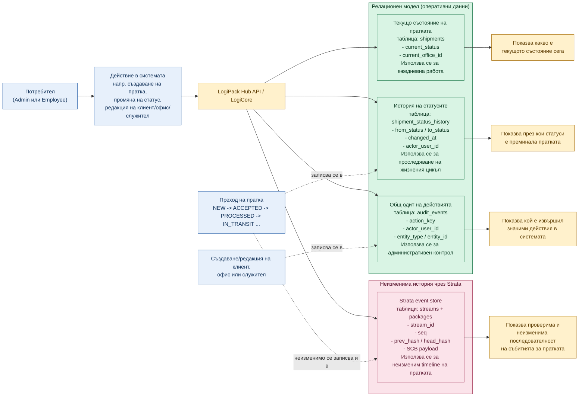

# Figure: Проследимост, история на статуси, общ одит и Strata в LogiPack

## Кратко тълкуване

- `Текущото състояние` показва актуалната оперативна информация за пратката и се пази в `shipments`.
- `Историята на статусите` показва през кои състояния е преминала конкретната пратка и се пази в `shipment_status_history`.
- `Общият одит` описва по-широк кръг от значими действия в системата, не само по пратки, и се пази в `audit_events`.
- `Strata` се използва за неизменимата timeline история на преходите на пратката чрез `streams` и `packages`.
- По този начин в LogiPack има ясно разграничение между:
  - текуща оперативна снимка
  - историческа статусна последователност
  - общ системен одит
  - неизменима event-based история чрез Strata

## Подходящ надпис под фигурата

`Фигура X. Концептуална схема на разликата между текущото състояние на пратката, историята на статусите, общия одит на действията и неизменимата timeline история чрез Strata в системата LogiPack.`
