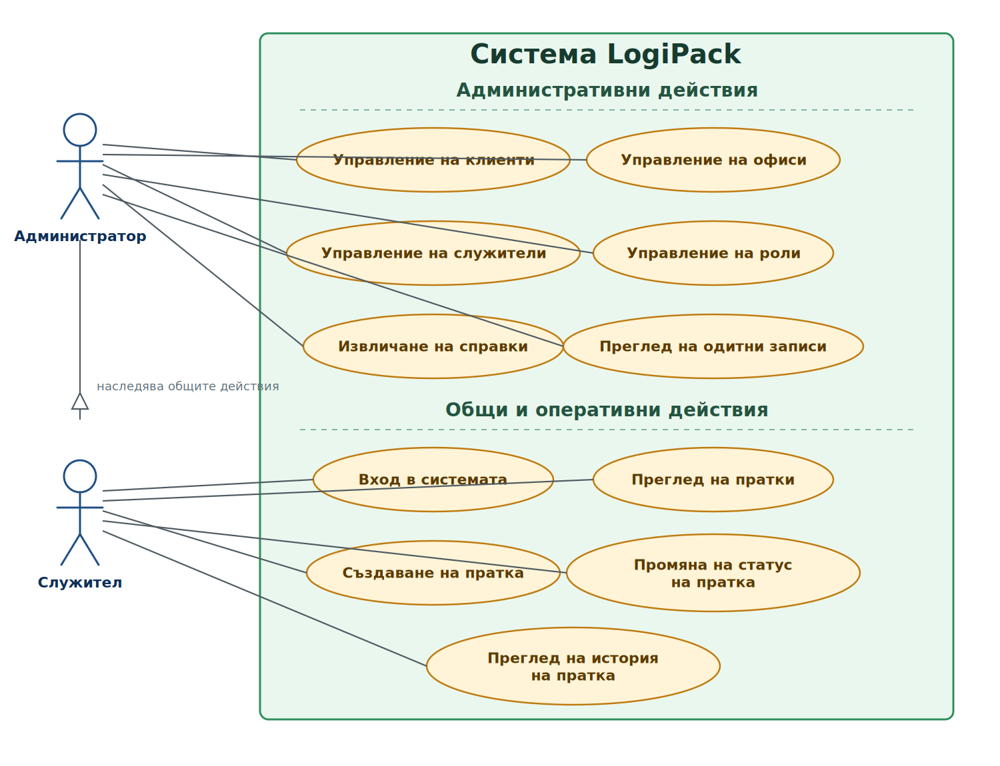

# Figure: UML диаграма на случаите на употреба на LogiPack

## Кратко тълкуване

- `Служителят` участва основно в оперативните действия по работа с пратки: вход в системата, преглед на пратки, създаване на пратка, промяна на статус и преглед на история.
- `Администраторът` наследява оперативните възможности на служителя и има допълнителни функции по управление на клиенти, офиси, служители, роли, справки и одитни записи.
- Диаграмата показва ролевото разграничаване в LogiPack, при което оперативните действия са достъпни и за двата типа потребители, а административните функции са ограничени до администратора.

## Подходящ надпис под фигурата

`Фиг. 5.1. UML диаграма на случаите на употреба на LogiPack, представяща основните участници в системата и действията, които могат да извършват според своята роля.`
